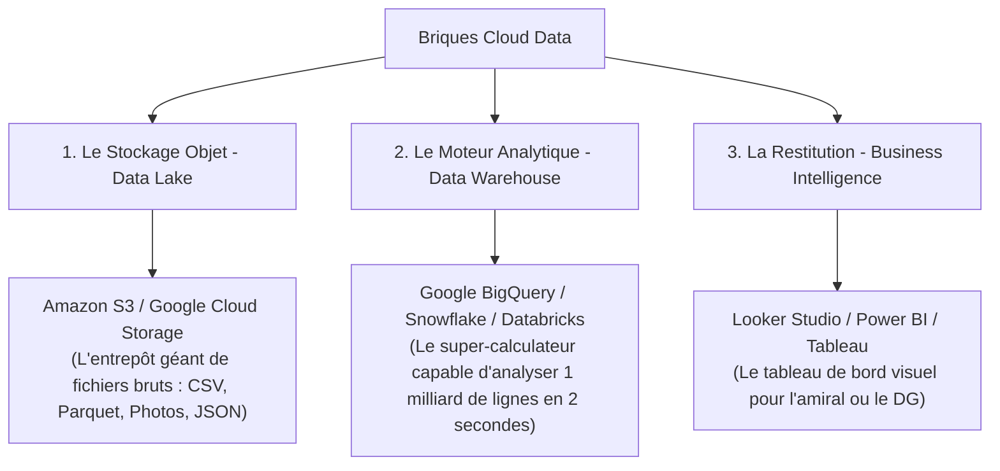

# Module 1 : Introduction au Cloud pour la Data (Démystification & Fondamentaux)

**Durée estimée :** 3h30 (Jour 1 - Matin)  
**Public :** Étudiants Master 2 (Profils non-ingénieurs / non-techniques)  
**Intervenant :** Data Manager – Marine Nationale

---

## 🧭 Objectifs de la session

1. Démystifier ce que le Cloud est… et ce qu'il n'est pas.
2. Comprendre pourquoi l'informatique traditionnelle ("On-Premise") a atteint ses limites face à l'explosion des données.
3. Maîtriser le vocabulaire clé du manager moderne : **IaaS, PaaS, SaaS, Serverless, Élasticité**.
4. Découvrir le cycle de vie de la donnée : de sa capture en mer jusqu'à l'écran d'un commandant ou d'un directeur d'opérations.

---

## 1. L'Accroche Opérationnelle : La Mer, Géant Invisible de la Data

### Une question pour ouvrir la discussion avec la classe :
> *"À votre avis, combien de navires commerciaux naviguent en ce moment même sur les océans du globe ?"*
> *(Réponse : Plus de 100 000 navires marchands de fort tonnage en circulation permanente).*

Chaque navire émet toutes les 2 à 10 secondes un signal radio automatique appelé **AIS (Automatic Identification System)** :
- Identifiant unique du navire (MMSI, Nom)
- Coordonnées GPS (Latitude, Longitude)
- Vitesse (Speed Over Ground - SOG), Cap (Course Over Ground - COG)
- Destination déclarée, tirant d'eau, type de cargaison (pétrole, conteneurs, pêche).

**Calcul rapide avec les étudiants :**
- 100 000 navires × 6 signaux par minute = **600 000 messages par minute**.
- Par jour = **864 millions de messages de position**.
- Ajoutez à cela : les images satellites optiques et radar, les prévisions météo haute précision de Météo France, les bouées océanographiques, les capteurs acoustiques sous-marins et les rapports de patrouille.

**Le constat :**
Si vous tentez d'ouvrir ne serait-ce qu'une semaine de ces données dans Microsoft Excel, le logiciel plante instantanément (Excel est limité à 1 048 576 lignes).
Si vous achetez un serveur physique pour stocker 5 ans de données, vous payez des dizaines de milliers d'euros pour une machine qui sera obsolète dans 3 ans, et qui brûlera peut-être si le local technique subit une inondation.

👉 **C'est précisément ici que le Cloud intervient.**

---

## 2. Qu'est-ce que le Cloud (sans jargon technique) ?

### La définition imagée
Le Cloud, ce n'est pas un nuage magique dans le ciel.  
**Le Cloud, c'est simplement l'ordinateur de quelqu'un d'autre**, accessible via Internet, avec trois super-pouvoirs :
1. **L'élasticité instantanée** : Vous pouvez louer 1 ordinateur pendant 1 an, ou 1 000 ordinateurs pendant 8 minutes. Le coût est le même, mais la vitesse d'analyse est multipliée par 1 000.
2. **Le paiement à l'usage (Pay-as-you-go)** : Comme l'électricité. Si la lumière est éteinte, vous ne payez rien. Si vous lancez une requête analytique lourde, vous ne payez que les quelques secondes de calcul.
3. **La délégation de la maintenance** : Zéro disque dur à remplacer, zéro salle climatisée à surveiller, zéro mise à jour du système d'exploitation à 2h du matin.

### On-Premise vs Cloud : L'analogie de la pizza
Pour faire comprendre la différence entre gérer son informatique soi-même et utiliser le Cloud :

| Modèle | En informatique | Exemple Data |
| :--- | :--- | :--- |
| **On-Premise (Sur site)** | Vous achetez vos propres serveurs physiques, louez une salle climatisée, gérez les pannes de disque dur et la sécurité incendie. | Serveur local de l'université ou baie informatique d'un port. |
| **IaaS (Infrastructure as a Service)** | Vous louez des machines virtuelles et du stockage brut. Vous installez Windows ou Linux et vos logiciels. | AWS EC2, Google Compute Engine, OVHcloud Public Cloud. |
| **PaaS (Platform as a Service)** | Vous ne gérez aucun serveur ni système d'exploitation. Vous déposez vos données et votre code. | Google BigQuery, Snowflake, Azure SQL Database. |
| **SaaS (Software as a Service)** | Vous utilisez une application web directement via votre navigateur. | Looker Studio, Salesforce, Google Drive, Power BI Service. |

---

## 3. Les Trois Grands Modèles de Service Data

Dans la vie d'un Data Manager, on rencontre principalement trois briques :

### Concept fondamental : Le "Serverless" (Sans Serveur)
- **Le terme est trompeur** : Il y a bien sûr des serveurs physiques derrière, mais **vous ne les voyez jamais**.
- **Ce que cela change pour un manager** :
  - Dans l'ancien monde : *"Chef, il faut 6 semaines pour commander un serveur, l'installer et créer la base de données avant de pouvoir analyser les escales de navires."*
  - Dans le monde Serverless Cloud : *"Je me connecte à BigQuery, je glisse mon fichier de 10 millions de lignes, je clique sur Exécuter, j'ai ma réponse dans 3 secondes, et cela m'a coûté 0,02 €."*

---

## 4. Qui sont les acteurs du marché ?

### Les trois "Hyperscalers" américains (90% du marché mondial) :
1. **Amazon Web Services (AWS)** : Le pionnier historique (créé en 2006). Le catalogue le plus riche, très présent dans l'industrie et la finance.
2. **Microsoft Azure** : Très fort dans les grandes entreprises grâce à l'écosystème Office 365, Teams et Windows.
3. **Google Cloud Platform (GCP)** : Le champion de la Data et de l'Intelligence Artificielle. Réputé pour son moteur **BigQuery** et ses solutions analytiques ergonomiques.

### Et en France / Europe ? L'enjeu de la confiance et de la défense :
- **OVHcloud, Scaleway, 3DS Outscale** : Fournisseurs européens respectant le droit européen (aucun risque d'extraterritorialité américaine).
- **Le label SecNumCloud (ANSSI)** : La norme française la plus stricte pour protéger les données régaliennes, militaires et de santé face aux lois étrangères comme le *Cloud Act* américain. *(Nous y reviendrons en détail au Jour 2).*

---

## 5. Mini-Quiz Interactif de mi-séance (15 minutes)

Proposez ce quiz aux étudiants (par sondage à main levée ou outil type Wooclap / Kahoot) :

1. **Question 1 : Si j'utilise Google Drive ou Microsoft OneDrive, quel type de service Cloud est-ce ?**
   - A) IaaS
   - B) PaaS
   - C) SaaS *(Bonne réponse)*
2. **Question 2 : Pourquoi une entreprise migre-t-elle ses données vers le Cloud ?**
   - A) Parce que les disques durs physiques n'existent plus.
   - B) Pour pouvoir adapter sa puissance de calcul à la demande et ne payer que ce qu'elle consomme. *(Bonne réponse)*
   - C) Parce que c'est toujours 100% gratuit.
3. **Question 3 : Dans la Marine Nationale, pourquoi un navire en haute mer a-t-il besoin d'une architecture hybride (Edge Computing à bord + Cloud à terre) ?**
   - *Réponse attendue :* Parce qu'en pleine mer, la connexion satellite peut être coupée ou brouillée par un adversaire ! Le navire doit pouvoir traiter ses données critiques localement (Edge), et synchroniser les données massives avec le Cloud une fois la liaison rétablie.

---

## 6. Synthèse de la matinée & Transition vers l'après-midi

En tant que futur manager ou décideur :
- Vous n'aurez pas à coder l'infrastructure.
- **En revanche**, vous devrez :
  1. Savoir exprimer un besoin data clair.
  2. Savoir interroger rapidement un jeu de données sans attendre 3 mois l'aide d'une équipe technique.
  3. Mesurer les coûts et choisir des architectures pérennes et sécurisées.

Cet après-midi, nous passons aux travaux pratiques : nous ouvrons la console Google BigQuery pour interroger la flotte maritime mondiale !
