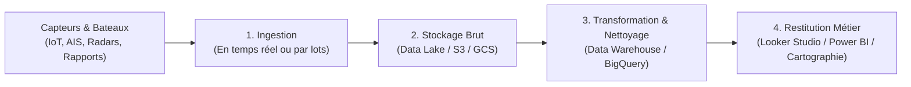

# Module 2 : L'Architecture Data Moderne & Le Cas Opérationnel Maritime

**Durée estimée :** Préparation au TP (30 min) + Support de référence pour l'Atelier Pratique  
**Public :** Étudiants Master 2 non-techniques  
**Intervenant :** Data Manager – Marine Nationale

---

## 🏗️ 1. L'Évolution des Architectures de Données

Avant de manipuler notre premier outil cloud, comprenons comment les entreprises et les armées organisent leurs données.



### Les 3 concepts indispensables :
1. **Le Data Lake (Le lac de données)** :
   - Imaginez un lac d'eau brute : on y verse tout ce qui arrive (fichiers audio de sonars, logs bruts, fichiers CSV mal rangés, photos satellites).
   - *Avantage :* Très peu cher, accepte tous les formats (structurés ou non).
   - *Risque :* Devenir un "Data Swamp" (marécage de données) si personne ne range ni ne documente les fichiers.
2. **Le Data Warehouse (L'entrepôt de données)** :
   - Imaginez un entrepôt Amazon ultra-organisé : chaque produit a un code-barres, un rayon précis, un format standardisé.
   - Les données y sont nettoyées, typées (dates, nombres, textes) et organisées en **tables relationnelles** (lignes et colonnes).
   - *Exemples :* **Google BigQuery**, **Snowflake**, **Amazon Redshift**.
3. **La séparation du Stockage et du Calcul (Storage vs Compute)** :
   - C'est LA révolution des années 2015-2025.
   - Dans une vieille base de données, pour avoir plus de disque dur, il fallait racheter un serveur entier avec de la mémoire et des processeurs.
   - Dans le Cloud moderne : vous stockez 50 Teraoctets pour quelques euros par mois. Et vous n'allumez la puissance de calcul que lorsque vous lancez une question ("Quelle est la vitesse moyenne des cargos russes dans la Manche en mars ?"). Dès que la réponse s'affiche, le calcul s'arrête et vous cessez de payer.

---

## ⚓ 2. Zoom sur la Donnée Maritime : Le Système AIS

Dans nos ateliers pratiques, nous allons nous appuyer sur des données **AIS (Automatic Identification System)**.

### Pourquoi l'AIS existe-t-il ?
Créé à l'origine par l'Organisation Maritime Internationale (OMI) pour **éviter les collisions en mer**, l'AIS est devenu la principale source de renseignement et de surveillance maritime mondiale.

### Comment ça marche ?
1. Le transpondeur à bord du navire calcule sa position par GPS.
2. Il émet un message radio VHF toutes les quelques secondes.
3. Le signal est capté par :
   - Les autres navires aux alentours (portée ~30 milles nautiques).
   - Les **stations terrestres côtières** (sémaphores de la Marine Nationale, CROSS).
   - Les **constellations de satellites en orbite basse** (SpaceX Starlink, Spire, exactEarth).
4. Ces données sont agrégées dans des pipelines Cloud pour offrir une "situation tactique de surface".

### Les défis de la donnée AIS (très formateurs pour des futurs managers !) :
- **Volume astronomique** : Des milliards de pings géolocalisés par an.
- **Tromperie / Spoofing** : Certains navires coupent volontairement leur balise ("vaisseaux fantômes") ou falsifient leur position GPS pour cacher des activités illicites (pêche illégale, contrebande de pétrole, transport d'armes).
- **Erreurs de saisie humaine** : Les marins écrivent parfois mal leur destination ("ROTTRDAM" au lieu de "ROTTERDAM"). Le Data Manager doit mettre en place des règles de nettoyage.

---

## 💻 3. SQL pour Non-Techniciens : Le Langage de la Décision

Pour interroger un Data Warehouse dans le Cloud (comme BigQuery), on utilise le **SQL** (*Structured Query Language*).

### Rassurez vos étudiants :
> *"Le SQL n'est pas un langage de programmation comme le C++ ou Python. C'est un langage déclaratif en anglais simple : vous dites à l'ordinateur **CE QUE VOUS VOULEZ**, et le moteur Cloud se débrouille pour aller chercher l'information parmi des millions de lignes."*

### Les 4 mots magiques du SQL :

```sql
SELECT    -- Quels indicateurs ou colonnes m'intéressent ? (ex: nom du navire, vitesse)
FROM      -- Dans quelle table se trouvent ces données ? (ex: flotte_maritime)
WHERE     -- Quels filtres appliquer ? (ex: uniquement les navires de type pétrolier)
ORDER BY  -- Comment classer les résultats ? (ex: du plus rapide au plus lent)
LIMIT     -- Combien de lignes afficher ? (ex: afficher le Top 10)
```

### Exemple concret traduit :
> *"Donne-moi le nom et la vitesse des 5 cargos les plus rapides actuellement en mer"*

```sql
SELECT 
    nom_navire, 
    vitesse_noeuds
FROM 
    `donnees_maritimes.positions_navires`
WHERE 
    type_navire = 'Cargo'
ORDER BY 
    vitesse_noeuds DESC
LIMIT 5;
```

C'est tout ! Les étudiants n'ont besoin que de cette structure mentale pour réussir l'ensemble des exercices.
